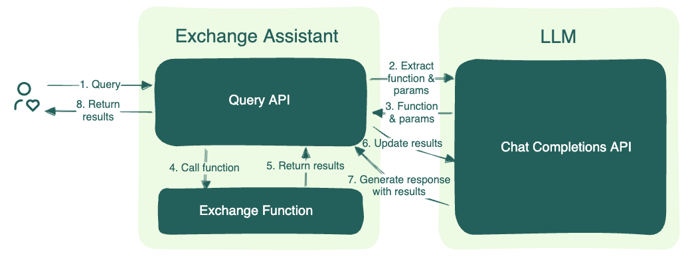

<div align="center">
    <h1 align="center">Building LLM function calling capabilities with BentoML</h1>
</div>

This example project demonstrates how to build LLM function calling capabilities with [BentoML](https://github.com/bentoml/BentoML). See [here](https://github.com/bentoml/BentoML/tree/main/examples) for a full list of BentoML example projects.

LLM function calling refers to the capability of LLMs to interact with user defined functions or APIs through natural language prompts. This allows the model to execute specific tasks, retrieve real-time data, or perform calculations beyond its trained knowledge. By calling functions, the LLM can extend its utility, enabling it to provide more accurate and dynamic responses by integrating external resources or executing code in real-time.

This repository demonstrates a currency exchange assistant that answers to queries in natural language and perform currency exchange calculations from one currancy to another.

User query:

```
{
  "query": "I want to exchange 42 US dollars to Canadian dollars"
}
```

Application responds by converting USD to CAD using a fictitious exchange rate of 1 to 3.14159.
```
The converted amount of 42 US dollars to Canadian dollars is 131.95 CAD.
```

## Architecture

This application includes two services, an exchange assitant API and an LLM. The LLM exposes an OpenAI compatible API so the exchange assitant can call with the OpenAI client. The exchange assistant first determines the function and extract parameters from the user query. It then calls the exchange function to get the results. Finally it calls the LLM again to generate a response including the results returned by the function.

This application sincludes two services: an Exchange Assistant API and an LLM.



- Query Interpretation: When a user submits a query, the Exchange Assistant API forwards it and prompt the LLM to determine the function name and extract parameters.

- Function Execution: With the extracted parameters, the API calls the identified exchange function. This function is responsible for the actual exchange between the currencies.

- Response Generation: Once the results are obtained, the API calls the LLM once again, with the results provided, to generate a response in natural language.

## Prerequisites

- Python 3.11 is recommended for this example.
- If you want to test the Service locally, you need a Nvidia GPU with sufficient VRAM to run the LLM. The included Llama 8B requires 24GB of VRAM to run.

## Install dependencies

```bash
git clone https://github.com/bentoml/BentoFunctionCalling.git
cd BentoFunctionCalling
pip install -r requirements.txt
```

## Run the BentoML Service

We have defined a BentoML Service in `service.py`. Run `bentoml serve` in your project directory to start the Service.

```bash
$ bentoml serve .
```

The server is now active at [http://localhost:3000](http://localhost:3000/). You can interact with it using the Swagger UI or in other different ways.


```
curl -X 'POST' \
  'http://localhost:3000/exchange' \
  -H 'accept: text/plain' \
  -H 'Content-Type: application/json' \
  -d '{
  "query": "I want to exchange 42 US dollars to Canadian dollars"
}'
```
